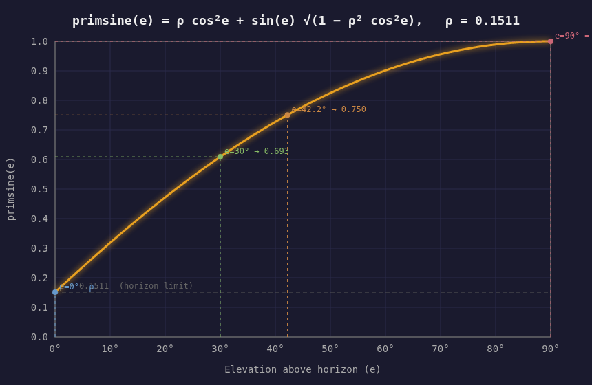

# Navigation Guide: Latitude by Pole Star, Longitude by Primus

*A technical reference for celestial navigation on Qaia.*

---

## Overview

A Qaian navigator has two celestial anchors:

1. **The pole star** — its elevation above the horizon equals your geographic latitude.
2. **Primus** — the geostationary moon, which fixes longitude without a chronometer.

Together these reduce a position fix to two angle measurements, both available on any
clear night. Navigators on the far side of Qaia lack Primus and must rely on dead
reckoning or stellar methods alone — a significant asymmetry in navigational capability.

---

## I. Finding Latitude: The Pole Star

Qaia's rotational axis points toward a star near the celestial north pole. Because the
axis holds a fixed orientation relative to the stars, the pole star never rises or sets;
it hangs motionless at a constant elevation above the north horizon.

**Rule**: elevation of the pole star = geographic latitude φ.

*In the southern hemisphere*, use the south celestial pole and measure elevation above
the south horizon; the same rule applies.

*Precision*: 0.1° of arc corresponds to about 11 km north–south. A good astrolabe or
cross-staff achieves this routinely on calm water.

---

## II. Primus: A Fixed Point in the Sky

Primus orbits Qaia at 42,160 km in a circular orbit whose period exactly matches
Qaia's sidereal day (23 h 56 m). Its orbital inclination to the ecliptic — 23.5° —
equals Qaia's axial tilt exactly. These two tilts cancel: Primus's orbital plane
coincides with Qaia's equatorial plane.

The result is a truly **geostationary** moon. From anywhere on the near-side hemisphere,
Primus is a motionless fixed point in the sky. It never rises, never sets, never drifts.
It is as stationary as the pole star, but sits on the celestial equator instead of the
celestial pole.

**Orbital facts (from MOONS.md):**

| Parameter | Value |
|---|---|
| Orbital radius | 42,160 km from Qaia's center |
| Altitude above surface | ~35,800 km |
| Period | 1 Qaia sidereal day (23 h 56 m) — geostationary |
| Sub-satellite point | Fixed at latitude 0°, longitude 0° (the prime meridian) |
| Apparent diameter | 10.4 arcminutes |
| Magnitude at full | −9.6 |

Because Primus hangs motionless, there is no special time to observe it, no phase to
wait for, and no oscillation to track. Pick any clear night, look up, and measure.

**Visibility**: Primus is permanently above the horizon for observers within roughly
±80° of the prime meridian at the equator (narrowing toward higher latitudes). It is
permanently invisible from the far-side hemisphere.

---

## III. Finding Longitude: The Elevation Method

### Principle

The sub-Primus point is always at geographic position (0° N, 0° E) — on the equator,
at the prime meridian, never moving. Measuring Primus's **elevation** angle places you
on a cone of constant geocentric angular distance ψ from that fixed point. Your latitude
φ (already known from the pole star) places you on a circle of latitude. These two
surfaces intersect at most at two points; knowing whether Primus appears to the east or
west of your local meridian (its **azimuth**) resolves which one.

No chronometer is needed because the measurement is purely geometric — the position of
a fixed object relative to your horizon.

### The primsine function

Define **primsine(e)** as the geocentric angular distance from the observer to the
sub-Primus point, expressed as a cosine, as a function of Primus's measured elevation e:

```
primsine(e) = ρ cos²e + sin(e) × sqrt(1 − ρ² cos²e)
```

where ρ = R_Qaia / r_Primus = 6371 / 42160 = **0.1511**.

This is analogous to the haversine: a function of one variable, defined specifically
to reduce a navigation calculation to a single table lookup. Because ρ is a fixed
physical constant of the Qaia–Primus system, primsine is a permanent function that
never needs to be recomputed or revised.

Two useful properties: primsine(90°) = 1 (Primus directly overhead → you are at the
sub-Primus point); primsine(0°) = ρ (Primus on the horizon → you are at the visibility
limit).



### The longitude formula

Because the sub-Primus point is on the equator, the spherical law of cosines gives:

```
primsine(e) = cos φ × cos λ
```

Solving for longitude:

```
cos λ = primsine(e) / cos φ
λ = ± arccos( primsine(e) / cos φ )
```

**Sign (east or west)**: if Primus appears to the **east** of due south (or due north),
you are **west** of the prime meridian. If Primus appears to the west, you are east.

---

## IV. Worked Example

**Observer**: latitude 30° N, Primus appearing slightly to the west. Measured elevation:
e = 42.2°.

**Primsine lookup (or calculation):**
```
cos(42.2°) = 0.7408    cos²(42.2°) = 0.5488    sin(42.2°) = 0.6717

ρ cos²e          = 0.1511 × 0.5488 = 0.0829
sin(e) sqrt(...)  ≈ 0.6717 × 0.9937 = 0.6675

primsine(42.2°) = 0.0829 + 0.6675 = 0.7504
```

**Longitude:**
```
cos λ = primsine(e) / cos φ = 0.7504 / cos(30°) = 0.7504 / 0.8660 = 0.8666
λ = arccos(0.8666) = 30°
```

Primus appears to the west → observer is at **30° East** of the prime meridian.

*(Check: cos 30° × cos 30° = 0.750 = primsine(42.2°) ✓)*

---

## V. Practical Considerations

### Navigation tables

In practice, primsine values are precomputed and printed once in the almanac — a single
permanent column, since primsine depends only on the fixed ratio ρ:

| Elevation e | primsine(e) |
|---|---|
| 5° | 0.279 |
| 10° | 0.398 |
| 20° | 0.565 |
| 30° | 0.693 |
| 45° | 0.837 |
| 60° | 0.927 |
| 75° | 0.981 |
| 90° | 1.000 |

With this column in hand, the complete at-sea procedure is three table lookups and one
division. Since `sin x = cos(90° − x)`, a single cosine table covers all steps:

| Step | Operation | Table use |
|---|---|---|
| 1 | look up primsine(e) | primsine column |
| 2 | look up cos φ | cosine table at φ |
| 3 | divide primsine(e) / cos φ → cos λ | one division |
| 4 | reverse-lookup cos λ → λ | cosine table read backwards |

A 1°-resolution primsine column covers every useful elevation in under 200 entries.
For navigators who want to skip even the division, a two-variable `(e, φ) → λ` table
fits the full near-side hemisphere in roughly 30,000 entries — standard nautical almanac
size.

### Accuracy

Longitude precision scales directly with elevation-measurement precision:

| Instrument | Latitude accuracy | Longitude accuracy |
|---|---|---|
| Simple astrolabe (~0.5°) | ~55 km | ~55–70 km |
| Good cross-staff (~0.1°) | ~11 km | ~11–14 km |
| Careful sextant (~0.05°) | ~6 km | ~6–7 km |

Sensitivity varies by location: it is highest near the equator and prime meridian
(Primus overhead, large elevation change per degree of longitude) and lowest near the
visibility boundary (Primus near the horizon, shallow geometry).

### Horizon visibility limits

The maximum geocentric angle at which Primus remains above the horizon is
ψ_max = arccos(ρ) ≈ **81.3°**, equivalently primsine(e) = ρ at e = 0°. In practice:

- From the **equator**, Primus is visible to roughly ±81° longitude from the prime meridian.
- From **higher latitudes**, the longitude range narrows. At 60° latitude, only
  observers within roughly ±72° longitude can see Primus.
- Near the visibility boundary, Primus is low on the horizon; atmospheric refraction is
  significant and precision is reduced.

### The prime meridian

The sub-Primus point defines longitude 0° — the most natural prime meridian choice on
Qaia. It requires no international agreement, no reference observatory, and no
historical convention: any navigator in the near hemisphere can identify it with a plumb
line and a clear sky.

### Far-side hemisphere

Primus is permanently below the horizon for the far-side hemisphere. Navigation there
requires dead reckoning, stellar transit observations, or lunar-distance methods (using
Secundus or Quartus against a star catalogue) — a substantially harder problem, exactly
analogous to Earth's pre-chronometer longitude difficulty.

---

## VI. Summary

| Step | Observation | Result |
|---|---|---|
| 1 | Pole star elevation above north horizon | Latitude φ |
| 2 | Primus elevation above horizon | primsine(e) → longitude magnitude |
| 3 | Primus azimuth (east or west of due south) | Longitude sign (E or W) |

Two angle measurements, no clock, no reference port, no lunar tables. Qaian navigators
solved the longitude problem not by building better chronometers, but by being born on
the right hemisphere of a world with a geostationary moon.
