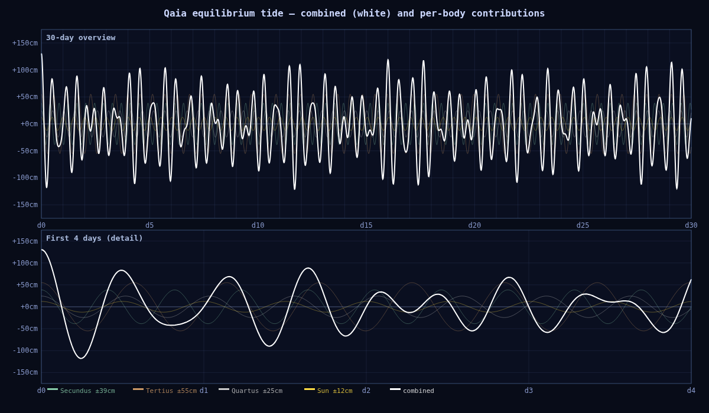

# Qaia Tidal Analysis

Generated from `bodies.js` parameters and the 200-year N-body snapshot (`state_200yr.json`). Re-run `node analysis/tide_sim.mjs` after any changes.

Assumes Qaia has a 24-hour solar day (matching Earth).

### Equilibrium tide model

The [equilibrium tide](https://en.wikipedia.org/wiki/Tide#Tidal_physics) is the theoretical
water-surface shape if the ocean responded instantly to tidal forcing with no friction or
basin dynamics. The half-amplitude of the tidal bulge is:

```
h_eq = (3/4) × (M_moon / M_planet) × (R_planet / a)³ × R_planet
```

Validated against Earth-Moon system (gives ~0.27 m, matching the known theoretical value).

### Primus — static, not oscillating

Primus is geosynchronous: it co-rotates with Qaia and does not sweep across the sky. It
raises a **permanent ~2 cm static tidal bulge** along the Primus–antiprimus axis — a fixed
geographic feature, not a daily cycle. It is excluded from the oscillating tide simulation.

### Simulation method

The tidal height at a fixed surface location is modelled as a sum of cosines, one per body:

```
h(t) = Σ  h_eq_i × cos(2π t / T_tide_i)
```

where `T_tide_i = T_syn_i / 2` is the semi-diurnal tidal period (two bulges per synodic
pass). `t = 0` is set to maximum alignment (all bodies at opposition), so each cosine starts
at its peak. This is the simplest possible model — it ignores ocean basin resonance, friction,
eccentricity-driven amplitude variation, and latitude effects. Real tides on Qaia would differ
substantially in amplitude (resonance can multiply the equilibrium value by ~10×) but the
periods and their interference structure would be the same.

---

## Equilibrium Tide Amplitudes

The equilibrium tide is what you'd get if the ocean could respond instantly. Real tides are
amplified by basin resonance (the Bay of Fundy amplifies Earth's 0.27 m equilibrium to 16 m).

| Body | Tidal period | Equilibrium ± | Notes |
|---|---|---|---|
| Secundus | 9.85 h | ±39 cm | Retrograde, fast |
| Tertius | 13.69 h | ±55 cm | Dominant driver |
| Quartus | 12.43 h | ±25 cm | Same as Earth's Moon |
| Sun | 12.03 h | ±12 cm | |
| **Total (aligned)** | | **±131 cm** | All at opposition simultaneously |

### Why Secundus's tidal period is 9.85 hours

Secundus is retrograde, so its apparent motion across Qaia's sky adds to Qaia's rotation rather
than subtracting. Its synodic period (time between overhead transits) is:

```
T_synodic = T_day × T_orb / (T_orb + T_day) = 24 × 109.68 / (109.68 + 24) = 19.69 h
```

The equilibrium tide has two bulges — one facing the moon, one on the opposite side. A point
on Qaia's surface passes through both bulges per synodic period, so the semi-diurnal tidal
period is half that: **9.85 h**. This gives ~2.4 high tides per Qaia day from Secundus.

Quartus at 12.43 h is nearly identical to Earth's Moon (12.42 h) — as expected, same orbit.

---

## Spring/Neap Beat Periods

Each pair of bodies creates a spring/neap cycle at the beat frequency of their tidal periods:

| Pair | Beat period | Character |
|---|---|---|
| Secundus + Tertius | 1.46 days | Fast amplitude modulation |
| Secundus + Quartus | 1.97 days | |
| Tertius + Quartus | 5.66 days | Medium-term envelope |
| Quartus + Sun | 15.56 days | Familiar fortnightly spring/neap |

The Quartus-Sun beat (~15.6 days) produces a fortnightly spring/neap analogous to Earth's.
Without Primus as a dominant fast driver, the tidal pattern is less extreme than the old
system but still complex — three incommensurate oscillating frequencies from the moons plus
the solar contribution.

---

## 30-Day Simulation

All moons at opposition (maximum alignment) at t=0. Height is equilibrium water level.



Regenerate with `node analysis/tide_sim.mjs`. ASCII table (1-hour resolution):

```
=== 30-day tide simulation (all moons at opposition, t=0) ===
  Overall range: -121 cm to +130 cm
  Max single-cycle swing: 251 cm

  t(h)   tide
     0h    +130cm  ██████████████████████████████
     1h    +112cm  ████████████████████████████
     2h     +64cm  ██████████████████████
     3h      -1cm  ██████████████
     4h     -63cm  ███████
     5h    -106cm  ██
     6h    -117cm  
     7h     -98cm  ███
     8h     -54cm  ████████
     9h      -1cm  ██████████████
    10h     +46cm  ████████████████████
    11h     +76cm  ███████████████████████
    12h     +83cm  ████████████████████████
    13h     +70cm  ███████████████████████
    14h     +44cm  ████████████████████
    15h     +14cm  ████████████████
    16h     -12cm  █████████████
    17h     -30cm  ███████████
    18h     -39cm  ██████████
    19h     -42cm  █████████
    20h     -41cm  ██████████
    21h     -37cm  ██████████
    22h     -30cm  ███████████
    23h     -18cm  ████████████
    24h      +0cm  ██████████████
    25h     +23cm  █████████████████
    26h     +47cm  ████████████████████
    27h     +64cm  ██████████████████████
    28h     +68cm  ███████████████████████
    29h     +54cm  █████████████████████
    30h     +23cm  █████████████████
    31h     -18cm  ████████████
    32h     -58cm  ████████
    33h     -84cm  ████
    34h     -89cm  ████
    35h     -68cm  ██████
    36h     -27cm  ███████████
    37h     +21cm  █████████████████
    38h     +63cm  ██████████████████████
    39h     +86cm  █████████████████████████
    40h     +84cm  ████████████████████████
    41h     +57cm  █████████████████████
    42h     +16cm  ████████████████
    43h     -26cm  ███████████
    44h     -56cm  ████████
    45h     -67cm  ██████
    46h     -56cm  ████████
    47h     -30cm  ███████████
    48h      +0cm  ██████████████
    49h     +24cm  █████████████████
    50h     +34cm  ██████████████████
    51h     +29cm  ██████████████████
    52h     +14cm  ████████████████
    53h      -2cm  ██████████████
    54h     -12cm  █████████████
    55h     -11cm  █████████████
    56h      -0cm  ██████████████
    57h     +15cm  ████████████████
    58h     +27cm  ██████████████████
    59h     +27cm  ██████████████████
    60h     +14cm  ████████████████
    61h      -9cm  █████████████
    62h     -34cm  ██████████
    63h     -51cm  ████████
    64h     -54cm  ████████
    65h     -38cm  ██████████
    66h      -8cm  █████████████
    67h     +27cm  ██████████████████
    68h     +55cm  █████████████████████
    69h     +67cm  ██████████████████████
    70h     +59cm  ██████████████████████
    71h     +34cm  ███████████████████
    72h      -0cm  ██████████████
    73h     -33cm  ███████████
    74h     -54cm  ████████
    75h     -58cm  ████████
    76h     -46cm  █████████
    77h     -23cm  ████████████
    78h      +1cm  ███████████████
    79h     +20cm  █████████████████
    80h     +29cm  ██████████████████
    81h     +28cm  ██████████████████
    82h     +21cm  █████████████████
    83h     +14cm  ████████████████
    84h     +11cm  ████████████████
    85h     +12cm  ████████████████
    86h     +13cm  ████████████████
    87h     +12cm  ████████████████
    88h      +3cm  ███████████████
    89h     -14cm  █████████████
    90h     -35cm  ██████████
    91h     -52cm  ████████
    92h     -58cm  ███████
    93h     -47cm  █████████
    94h     -18cm  ████████████
    95h     +23cm  █████████████████
    96h     +63cm  ██████████████████████
    97h     +89cm  █████████████████████████
    98h     +92cm  █████████████████████████
    99h     +68cm  ██████████████████████
   100h     +21cm  █████████████████
   101h     -34cm  ██████████
   102h     -82cm  █████
   103h    -108cm  █
   104h    -104cm  ██
   105h     -71cm  ██████
   106h     -18cm  ████████████
   107h     +39cm  ███████████████████
   108h     +83cm  ████████████████████████
   109h    +103cm  ███████████████████████████
   110h     +93cm  ██████████████████████████
   111h     +60cm  ██████████████████████
   112h     +15cm  ████████████████
   113h     -29cm  ███████████
   114h     -61cm  ███████
   115h     -73cm  ██████
   116h     -66cm  ███████
   117h     -47cm  █████████
   118h     -21cm  ████████████
   119h      +2cm  ███████████████
   120h     +19cm  █████████████████
   121h     +29cm  ██████████████████
   122h     +35cm  ███████████████████
   123h     +38cm  ███████████████████
   124h     +39cm  ███████████████████
   125h     +38cm  ███████████████████
   126h     +31cm  ██████████████████
   127h     +15cm  ████████████████
   128h      -9cm  █████████████
   129h     -38cm  ██████████
   130h     -64cm  ███████
   131h     -77cm  █████
   132h     -72cm  ██████
   133h     -46cm  █████████
   134h      -3cm  ██████████████
   135h     +45cm  ████████████████████
   136h     +84cm  █████████████████████████
   137h    +103cm  ███████████████████████████
   138h     +94cm  ██████████████████████████
   139h     +58cm  █████████████████████
   140h      +5cm  ███████████████
   141h     -50cm  ████████
   142h     -91cm  ████
   143h    -106cm  ██
   144h     -91cm  ████
   145h     -52cm  ████████
   146h      -2cm  ██████████████
   147h     +45cm  ████████████████████
   148h     +76cm  ███████████████████████
   149h     +83cm  ████████████████████████
   150h     +67cm  ██████████████████████
   151h     +37cm  ███████████████████
   152h      +3cm  ███████████████
   153h     -25cm  ███████████
   154h     -40cm  ██████████
   155h     -42cm  █████████
   156h     -34cm  ██████████
   157h     -23cm  ████████████
   158h     -14cm  █████████████
   159h      -9cm  █████████████
   160h      -7cm  ██████████████
   161h      -4cm  ██████████████
   162h      +4cm  ███████████████
   163h     +17cm  █████████████████
   164h     +34cm  ██████████████████
   165h     +48cm  ████████████████████
   166h     +52cm  █████████████████████
   167h     +40cm  ███████████████████
   168h     +14cm  ████████████████
   169h     -21cm  ████████████
   170h     -55cm  ████████
   171h     -78cm  █████
   172h     -79cm  █████
   173h     -58cm  ████████
   174h     -18cm  ████████████
   175h     +29cm  ██████████████████
   176h     +68cm  ███████████████████████
   177h     +88cm  █████████████████████████
   178h     +82cm  ████████████████████████
   179h     +54cm  █████████████████████
   180h     +12cm  ████████████████
   181h     -31cm  ███████████
   182h     -62cm  ███████
   183h     -73cm  ██████
   184h     -62cm  ███████
   185h     -36cm  ██████████
   186h      -5cm  ██████████████
   187h     +22cm  █████████████████
   188h     +36cm  ███████████████████
   189h     +37cm  ███████████████████
   190h     +28cm  ██████████████████
   191h     +15cm  ████████████████
   192h      +4cm  ███████████████
   193h      +1cm  ███████████████
   194h      +3cm  ███████████████
   195h      +7cm  ███████████████
   196h      +8cm  ███████████████
   197h      +0cm  ██████████████
   198h     -14cm  █████████████
   199h     -32cm  ███████████
   200h     -45cm  █████████
   201h     -46cm  █████████
   202h     -32cm  ███████████
   203h      -4cm  ██████████████
   204h     +30cm  ██████████████████
   205h     +59cm  █████████████████████
   206h     +73cm  ███████████████████████
   207h     +66cm  ██████████████████████
   208h     +39cm  ███████████████████
   209h      -1cm  ██████████████
   210h     -42cm  █████████
   211h     -71cm  ██████
   212h     -79cm  █████
   213h     -63cm  ███████
   214h     -31cm  ███████████
   215h      +8cm  ███████████████
   216h     +42cm  ███████████████████
   217h     +60cm  ██████████████████████
   218h     +59cm  █████████████████████
   219h     +42cm  ███████████████████
   220h     +16cm  ████████████████
   221h      -8cm  █████████████
   222h     -24cm  ████████████
   223h     -27cm  ███████████
   224h     -21cm  ████████████
   225h     -12cm  █████████████
   226h      -4cm  ██████████████
   227h      -4cm  ██████████████
   228h     -10cm  █████████████
   229h     -18cm  ████████████
   230h     -21cm  ████████████
   231h     -15cm  █████████████
   232h      +1cm  ███████████████
   233h     +25cm  █████████████████
   234h     +48cm  ████████████████████
   235h     +60cm  ██████████████████████
   236h     +55cm  █████████████████████
   237h     +31cm  ██████████████████
   238h      -7cm  ██████████████
   239h     -47cm  █████████
   240h     -78cm  █████
   241h     -87cm  ████
   242h     -71cm  ██████
   243h     -34cm  ██████████
   244h     +14cm  ████████████████
   245h     +59cm  █████████████████████
   246h     +87cm  █████████████████████████
   247h     +90cm  █████████████████████████
   248h     +68cm  ███████████████████████
   249h     +29cm  ██████████████████
   250h     -15cm  █████████████
   251h     -51cm  ████████
   252h     -70cm  ██████
   253h     -70cm  ██████
   254h     -52cm  ████████
   255h     -26cm  ███████████
   256h      +1cm  ███████████████
   257h     +21cm  █████████████████
   258h     +32cm  ██████████████████
   259h     +35cm  ███████████████████
   260h     +34cm  ██████████████████
   261h     +31cm  ██████████████████
   262h     +28cm  ██████████████████
   263h     +24cm  █████████████████
   264h     +16cm  ████████████████
   265h      +0cm  ██████████████
   266h     -22cm  ████████████
   267h     -46cm  █████████
   268h     -66cm  ███████
   269h     -72cm  ██████
   270h     -58cm  ███████
   271h     -26cm  ███████████
   272h     +19cm  █████████████████
   273h     +66cm  ██████████████████████
   274h     +99cm  ██████████████████████████
   275h    +107cm  ███████████████████████████
   276h     +85cm  █████████████████████████
   277h     +37cm  ███████████████████
   278h     -23cm  ████████████
   279h     -80cm  █████
   280h    -115cm  █
   281h    -119cm  
   282h     -89cm  ████
   283h     -36cm  ██████████
   284h     +26cm  █████████████████
   285h     +78cm  ████████████████████████
   286h    +107cm  ███████████████████████████
   287h    +105cm  ███████████████████████████
   288h     +77cm  ████████████████████████
   289h     +31cm  ██████████████████
   290h     -18cm  ████████████
   291h     -56cm  ████████
   292h     -75cm  █████
   293h     -74cm  ██████
   294h     -56cm  ████████
   295h     -30cm  ███████████
   296h      -4cm  ██████████████
   297h     +16cm  ████████████████
   298h     +29cm  ██████████████████
   299h     +36cm  ███████████████████
   300h     +39cm  ███████████████████
   301h     +39cm  ███████████████████
   302h     +37cm  ███████████████████
   303h     +30cm  ██████████████████
   304h     +16cm  ████████████████
   305h      -5cm  ██████████████
   306h     -31cm  ███████████
   307h     -55cm  ████████
   308h     -70cm  ██████
   309h     -68cm  ██████
   310h     -47cm  █████████
   311h     -10cm  █████████████
   312h     +33cm  ██████████████████
   313h     +71cm  ███████████████████████
   314h     +91cm  █████████████████████████
   315h     +86cm  █████████████████████████
   316h     +57cm  █████████████████████
   317h     +10cm  ████████████████
   318h     -39cm  ██████████
   319h     -77cm  █████
   320h     -91cm  ████
   321h     -79cm  █████
   322h     -45cm  █████████
   323h      +0cm  ██████████████
   324h     +41cm  ███████████████████
   325h     +65cm  ██████████████████████
   326h     +68cm  ███████████████████████
   327h     +50cm  ████████████████████
   328h     +20cm  █████████████████
   329h     -10cm  █████████████
   330h     -31cm  ███████████
   331h     -37cm  ██████████
   332h     -28cm  ███████████
   333h     -11cm  █████████████
   334h      +5cm  ███████████████
   335h     +13cm  ████████████████
   336h     +10cm  ████████████████
   337h      -2cm  ██████████████
   338h     -16cm  ████████████
   339h     -25cm  ███████████
   340h     -22cm  ████████████
   341h      -6cm  ██████████████
   342h     +16cm  ████████████████
   343h     +38cm  ███████████████████
   344h     +50cm  ████████████████████
   345h     +45cm  ████████████████████
   346h     +25cm  █████████████████
   347h      -5cm  ██████████████
   348h     -36cm  ██████████
   349h     -57cm  ████████
   350h     -61cm  ███████
   351h     -47cm  █████████
   352h     -19cm  ████████████
   353h     +13cm  ████████████████
   354h     +39cm  ███████████████████
   355h     +52cm  █████████████████████
   356h     +49cm  ████████████████████
   357h     +33cm  ██████████████████
   358h     +12cm  ████████████████
   359h      -8cm  ██████████████
   360h     -20cm  ████████████
   361h     -23cm  ████████████
   362h     -19cm  ████████████
   363h     -14cm  █████████████
   364h     -11cm  █████████████
   365h     -13cm  █████████████
   366h     -18cm  ████████████
   367h     -21cm  ████████████
   368h     -16cm  ████████████
   369h      -2cm  ██████████████
   370h     +21cm  █████████████████
   371h     +46cm  ████████████████████
   372h     +63cm  ██████████████████████
   373h     +64cm  ██████████████████████
   374h     +45cm  ████████████████████
   375h      +8cm  ███████████████
   376h     -38cm  ██████████
   377h     -79cm  █████
   378h    -101cm  ██
   379h     -95cm  ███
   380h     -60cm  ███████
   381h      -5cm  ██████████████
   382h     +54cm  █████████████████████
   383h    +100cm  ██████████████████████████
   384h    +119cm  █████████████████████████████
   385h    +104cm  ███████████████████████████
   386h     +61cm  ██████████████████████
   387h      +1cm  ███████████████
   388h     -58cm  ████████
   389h     -99cm  ███
   390h    -111cm  █
   391h     -94cm  ███
   392h     -54cm  ████████
   393h      -4cm  ██████████████
   394h     +42cm  ███████████████████
   395h     +72cm  ███████████████████████
   396h     +82cm  ████████████████████████
   397h     +72cm  ███████████████████████
   398h     +49cm  ████████████████████
   399h     +21cm  █████████████████
   400h      -7cm  ██████████████
   401h     -28cm  ███████████
   402h     -42cm  █████████
   403h     -50cm  ████████
   404h     -52cm  ████████
   405h     -49cm  █████████
   406h     -39cm  ██████████
   407h     -21cm  ████████████
   408h      +5cm  ███████████████
   409h     +35cm  ███████████████████
   410h     +64cm  ██████████████████████
   411h     +83cm  ████████████████████████
   412h     +83cm  ████████████████████████
   413h     +61cm  ██████████████████████
   414h     +20cm  █████████████████
   415h     -32cm  ███████████
   416h     -79cm  █████
   417h    -108cm  ██
   418h    -109cm  █
   419h     -80cm  █████
   420h     -27cm  ███████████
   421h     +34cm  ███████████████████
   422h     +87cm  █████████████████████████
   423h    +115cm  ████████████████████████████
   424h    +111cm  ████████████████████████████
   425h     +76cm  ████████████████████████
   426h     +22cm  █████████████████
   427h     -35cm  ██████████
   428h     -79cm  █████
   429h     -97cm  ███
   430h     -88cm  ████
   431h     -56cm  ████████
   432h     -14cm  █████████████
   433h     +26cm  ██████████████████
   434h     +52cm  █████████████████████
   435h     +59cm  ██████████████████████
   436h     +50cm  ████████████████████
   437h     +31cm  ██████████████████
   438h     +10cm  ████████████████
   439h      -5cm  ██████████████
   440h     -12cm  █████████████
   441h     -12cm  █████████████
   442h     -10cm  █████████████
   443h     -11cm  █████████████
   444h     -16cm  █████████████
   445h     -24cm  ████████████
   446h     -31cm  ███████████
   447h     -30cm  ███████████
   448h     -19cm  ████████████
   449h      +3cm  ███████████████
   450h     +28cm  ██████████████████
   451h     +51cm  ████████████████████
   452h     +61cm  ██████████████████████
   453h     +53cm  █████████████████████
   454h     +29cm  ██████████████████
   455h      -5cm  ██████████████
   456h     -40cm  ██████████
   457h     -63cm  ███████
   458h     -68cm  ██████
   459h     -53cm  ████████
   460h     -23cm  ████████████
   461h     +12cm  ████████████████
   462h     +41cm  ███████████████████
   463h     +54cm  █████████████████████
   464h     +50cm  ████████████████████
   465h     +32cm  ██████████████████
   466h      +8cm  ███████████████
   467h     -14cm  █████████████
   468h     -25cm  ███████████
   469h     -24cm  ████████████
   470h     -14cm  █████████████
   471h      -1cm  ██████████████
   472h      +7cm  ███████████████
   473h      +5cm  ███████████████
   474h      -5cm  ██████████████
   475h     -18cm  ████████████
   476h     -28cm  ███████████
   477h     -27cm  ███████████
   478h     -13cm  █████████████
   479h     +13cm  ████████████████
   480h     +40cm  ███████████████████
   481h     +60cm  ██████████████████████
   482h     +62cm  ██████████████████████
   483h     +44cm  ████████████████████
   484h      +9cm  ███████████████
   485h     -33cm  ██████████
   486h     -68cm  ██████
   487h     -85cm  ████
   488h     -77cm  █████
   489h     -46cm  █████████
   490h      -0cm  ██████████████
   491h     +45cm  ████████████████████
   492h     +77cm  ████████████████████████
   493h     +87cm  █████████████████████████
   494h     +72cm  ███████████████████████
   495h     +38cm  ███████████████████
   496h      -3cm  ██████████████
   497h     -40cm  ██████████
   498h     -62cm  ███████
   499h     -65cm  ███████
   500h     -52cm  ████████
   501h     -29cm  ███████████
   502h      -5cm  ██████████████
   503h     +14cm  ████████████████
   504h     +25cm  █████████████████
   505h     +28cm  ██████████████████
   506h     +27cm  ██████████████████
   507h     +27cm  ██████████████████
   508h     +27cm  ██████████████████
   509h     +26cm  ██████████████████
   510h     +22cm  █████████████████
   511h     +11cm  ████████████████
   512h      -9cm  █████████████
   513h     -34cm  ██████████
   514h     -57cm  ████████
   515h     -69cm  ██████
   516h     -64cm  ███████
   517h     -39cm  ██████████
   518h      +1cm  ███████████████
   519h     +47cm  ████████████████████
   520h     +84cm  ████████████████████████
   521h    +100cm  ██████████████████████████
   522h     +89cm  █████████████████████████
   523h     +51cm  █████████████████████
   524h      -2cm  ██████████████
   525h     -57cm  ████████
   526h     -96cm  ███
   527h    -108cm  ██
   528h     -90cm  ████
   529h     -48cm  █████████
   530h      +5cm  ███████████████
   531h     +54cm  █████████████████████
   532h     +84cm  █████████████████████████
   533h     +90cm  █████████████████████████
   534h     +72cm  ███████████████████████
   535h     +38cm  ███████████████████
   536h      -0cm  ██████████████
   537h     -32cm  ███████████
   538h     -50cm  ████████
   539h     -53cm  ████████
   540h     -44cm  █████████
   541h     -30cm  ███████████
   542h     -16cm  █████████████
   543h      -5cm  ██████████████
   544h      +2cm  ███████████████
   545h      +9cm  ████████████████
   546h     +19cm  █████████████████
   547h     +30cm  ██████████████████
   548h     +43cm  ████████████████████
   549h     +49cm  ████████████████████
   550h     +45cm  ████████████████████
   551h     +28cm  ██████████████████
   552h      -3cm  ██████████████
   553h     -39cm  ██████████
   554h     -70cm  ██████
   555h     -86cm  ████
   556h     -79cm  █████
   557h     -48cm  █████████
   558h      -1cm  ██████████████
   559h     +49cm  ████████████████████
   560h     +88cm  █████████████████████████
   561h    +102cm  ███████████████████████████
   562h     +89cm  █████████████████████████
   563h     +50cm  ████████████████████
   564h      -2cm  ██████████████
   565h     -51cm  ████████
   566h     -85cm  ████
   567h     -93cm  ███
   568h     -76cm  █████
   569h     -40cm  ██████████
   570h      +3cm  ███████████████
   571h     +39cm  ███████████████████
   572h     +59cm  ██████████████████████
   573h     +61cm  ██████████████████████
   574h     +48cm  ████████████████████
   575h     +27cm  ██████████████████
   576h      +6cm  ███████████████
   577h     -10cm  █████████████
   578h     -17cm  ████████████
   579h     -18cm  ████████████
   580h     -18cm  ████████████
   581h     -20cm  ████████████
   582h     -25cm  ████████████
   583h     -29cm  ███████████
   584h     -30cm  ███████████
   585h     -21cm  ████████████
   586h      -3cm  ██████████████
   587h     +23cm  █████████████████
   588h     +49cm  ████████████████████
   589h     +66cm  ██████████████████████
   590h     +66cm  ██████████████████████
   591h     +46cm  ████████████████████
   592h     +10cm  ████████████████
   593h     -32cm  ███████████
   594h     -68cm  ██████
   595h     -86cm  ████
   596h     -80cm  █████
   597h     -50cm  ████████
   598h      -6cm  ██████████████
   599h     +40cm  ███████████████████
   600h     +73cm  ███████████████████████
   601h     +83cm  ████████████████████████
   602h     +70cm  ███████████████████████
   603h     +37cm  ███████████████████
   604h      -3cm  ██████████████
   605h     -37cm  ██████████
   606h     -56cm  ████████
   607h     -56cm  ████████
   608h     -41cm  ██████████
   609h     -16cm  ████████████
   610h      +6cm  ███████████████
   611h     +20cm  █████████████████
   612h     +22cm  █████████████████
   613h     +15cm  ████████████████
   614h      +5cm  ███████████████
   615h      -1cm  ██████████████
   616h      +0cm  ██████████████
   617h      +9cm  ████████████████
   618h     +21cm  █████████████████
   619h     +28cm  ██████████████████
   620h     +25cm  █████████████████
   621h      +9cm  ████████████████
   622h     -15cm  █████████████
   623h     -40cm  ██████████
   624h     -56cm  ████████
   625h     -57cm  ████████
   626h     -39cm  ██████████
   627h      -7cm  ██████████████
   628h     +30cm  ██████████████████
   629h     +60cm  ██████████████████████
   630h     +73cm  ███████████████████████
   631h     +65cm  ██████████████████████
   632h     +38cm  ███████████████████
   633h      +0cm  ██████████████
   634h     -35cm  ██████████
   635h     -59cm  ███████
   636h     -64cm  ███████
   637h     -51cm  ████████
   638h     -26cm  ███████████
   639h      +2cm  ███████████████
   640h     +24cm  █████████████████
   641h     +34cm  ██████████████████
   642h     +33cm  ██████████████████
   643h     +24cm  █████████████████
   644h     +14cm  ████████████████
   645h      +7cm  ███████████████
   646h      +6cm  ███████████████
   647h      +8cm  ███████████████
   648h     +10cm  ████████████████
   649h      +5cm  ███████████████
   650h      -9cm  █████████████
   651h     -28cm  ███████████
   652h     -46cm  █████████
   653h     -56cm  ████████
   654h     -49cm  █████████
   655h     -25cm  ███████████
   656h     +13cm  ████████████████
   657h     +54cm  █████████████████████
   658h     +84cm  ████████████████████████
   659h     +93cm  ██████████████████████████
   660h     +75cm  ███████████████████████
   661h     +33cm  ██████████████████
   662h     -22cm  ████████████
   663h     -73cm  ██████
   664h    -106cm  ██
   665h    -109cm  █
   666h     -82cm  █████
   667h     -32cm  ███████████
   668h     +26cm  ██████████████████
   669h     +76cm  ███████████████████████
   670h    +103cm  ███████████████████████████
   671h    +101cm  ███████████████████████████
   672h     +74cm  ███████████████████████
   673h     +30cm  ██████████████████
   674h     -18cm  ████████████
   675h     -55cm  ████████
   676h     -75cm  █████
   677h     -75cm  █████
   678h     -59cm  ███████
   679h     -34cm  ██████████
   680h      -8cm  ██████████████
   681h     +15cm  ████████████████
   682h     +31cm  ██████████████████
   683h     +42cm  ███████████████████
   684h     +48cm  ████████████████████
   685h     +49cm  ████████████████████
   686h     +46cm  ████████████████████
   687h     +34cm  ███████████████████
   688h     +14cm  ████████████████
   689h     -14cm  █████████████
   690h     -45cm  █████████
   691h     -72cm  ██████
   692h     -85cm  ████
   693h     -78cm  █████
   694h     -48cm  █████████
   695h      -2cm  ██████████████
   696h     +51cm  ████████████████████
   697h     +94cm  ██████████████████████████
   698h    +114cm  ████████████████████████████
   699h    +103cm  ███████████████████████████
   700h     +63cm  ██████████████████████
   701h      +4cm  ███████████████
   702h     -57cm  ████████
   703h    -103cm  ██
   704h    -120cm  
   705h    -103cm  ██
   706h     -59cm  ███████
   707h      +0cm  ██████████████
   708h     +56cm  █████████████████████
   709h     +92cm  █████████████████████████
   710h    +101cm  ██████████████████████████
   711h     +81cm  ████████████████████████
   712h     +43cm  ████████████████████
   713h      -2cm  ██████████████
   714h     -40cm  ██████████
   715h     -61cm  ███████
   716h     -62cm  ███████
   717h     -48cm  █████████
   718h     -26cm  ███████████
   719h      -4cm  ██████████████
   720h     +11cm  ████████████████
```

---

## Worldbuilding Implications

**Pattern complexity**: Earth has one dominant tidal frequency (M2, 12.42 h) with weak
overtones — sailors can learn to predict tides by watching the Moon. Qaia has four
comparable forcing frequencies (9.85h, 13.69h, 12.43h, 12.03h); accurate prediction
requires written tidal tables, though the tides are far less violent than if Primus were
oscillating.

**Primus's geosynchronous effect**: Instead of contributing a fast, large oscillating tide,
Primus raises only a small (~2 cm) permanent bulge on the sub-Primus side of Qaia. This
is a permanent feature of sea level geography — the ocean is very slightly deeper beneath
Primus.

**Tidal range**: The maximum equilibrium range (all aligned) is ~2.5 m. With ocean basin
resonance this could be amplified to potentially 10–30 m in narrow bays — comparable to
Earth's most extreme tidal locations but not catastrophically beyond them.

**Retrograde visual cues**: A coastal observer can watch Secundus rising in the west and
estimate tidal timing. Tertius (prograde, ~8-day period) is the dominant tidal driver;
when Tertius and Secundus are in the same part of the sky, expect amplified tides.

**Long-term**: Secundus (retrograde) spirals inward over geological time due to tidal
friction, slowly increasing its tidal contribution. Tertius and Quartus (prograde) recede,
like Earth's Moon. Primus is magically anchored — no migration.
