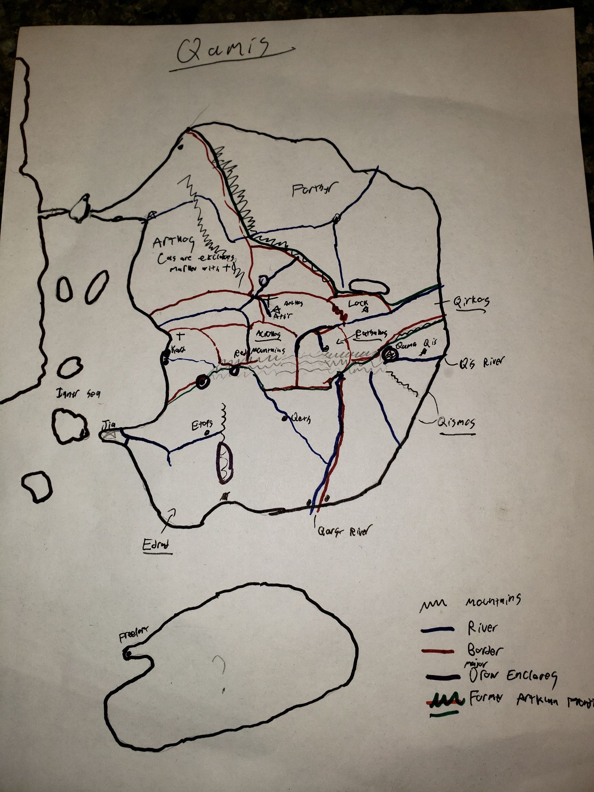
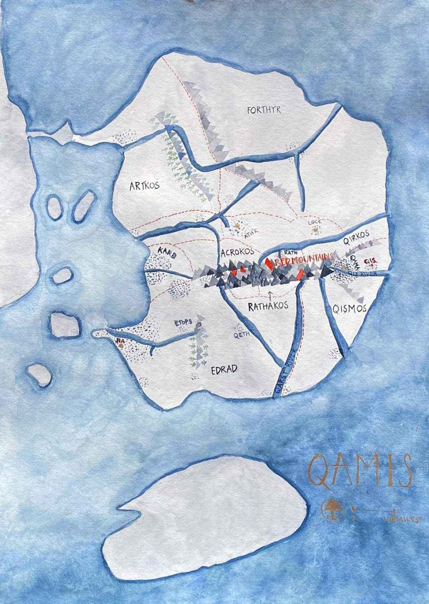

# Qaringil (Qamis prequel!)
**Intro**

## On blank spaces

There are a lot of blank spaces on the map that need to be filled. You can help with that.

## Map

It’s possible that this will be useful to you if you zoom in and squint. No promises though.

A nicer version:

## Map differences

The map borders are from 200 years after this campaign. There are several major differences:

- Edrad does not control Qeth and the region to the northeast of it, but conquering them remains a prime goal of Edran foreign policy.
- Qismos does not exist as a unified nation, but is a geographic and cultural region.
- The Holy Qis Empire rules from Ath’r over central Qamis, Qirkos, and Qismos north of the river.
- Artkos is only its historical heartland in the northwest.
- Rathakos and Acrokos fully do not exist

## Language
- There are no racial languages — no elvish, dwarvish, etc
- Q is pronounced “Kh”
- Old Draconic (or Old Qis) is the language of scholarly publications and treaties - the “q without u”  that appears in many place names is from Old Draconic
- The main languages are national:
    - Edran
    - Artklan
    - Qis
    - Forthrian
    - Islas
- Artklan is spoken in the central parts of the Holy Qis Empire, which is neither holy, nor Qis, nor an empire.
- These languages are not standardized, however, and contain major regional variations. For example, most speakers from the capital of Artkos would have trouble understanding the Artklan of a speaker from Rathakos. So without qualification, the languages will be understood as meaning the prestige dialect of the language spoken in the capital and by the ruling class.
- For your starting language, assume you can speak the capital dialect and one regional dialect
- I guess everyone gets one bonus language too but you have to tell me how you know it

# Nations
## Islands

The islands of the central sea are populated primarily from exiles from both continents. Many are thassolocracies of nautical robber barons who sell their powerful mercenary navies to continental powers.

**Qaringil**
This is where the campaign is based.

There is a narrow wizard-made isthmus that crosses the central sea near its northern end, helped by two enormous bridges connected to a volcanic island.

On the western shore of the island between the bridges is the famous city of Qaringil. Criss-crossed with canals and ruled as an incomprehensible republic, its armed merchant fleets fan out across the inland sea while its fortifications dominate the Great Western Bridge.

The primary language is Islas. The city was originally built primarily by adventurers and laborers from Qismos, and so the variety of Islas spoken has heavier than usual Qis vocabulary.

The current Exarch, Giovanni Pesaro, has held the post for 19 years and is considered to be on death’s doorstep.

As a city state that relies mostly on fishing and importation for food, the elites are Qaringil are *primarily* commercial, not landowners. (Though many now have substantial landholdings in other areas.)

The population is around 100,000.

**Great Guilds:**

- Judicial
- Mercantile
- Shipping
- Silk
- Banking
- Gondolier
- Wool

Silk and wool include both production and trade in those items. Merchants guild regulates trade of other commodities.
The gondolier guild also covers maintanance and control of the bridges. Along with the Wool guild, they have never been led by one of the major families.
There are of course many "minor" guilds.

**Smaller guilds most relevant to party:**

- Adventurer
- Alchemist
- Mage

The party is fifth level so you can all easily be full guild members of anything relevant to your class.

There are also several competing but underground criminal organizations that style themselves as guilds:

- Thieves
- Bandits
- Cutpurses

**Five Families:**
These are the five most prominent families in Qaringil. They have leadership of four of the seven major guilds and interests in many other areas.
They are all mostly human, though all have some elf ancestry.
The current Exarch is from a minor family, but is considered to be aligned most closely with the Peixota and Manos families.

- Peixota
    - Sigil: Dolphin
    - Leads: Shipping Guild
    - Also involved in mercantile, judicial
- Manos
    - Sigil: Hand
    - Leads: Judicial Guild
    - Also involved in silk, wool
    - Their entry into the wool scene is hotly contested
- Qanto
    - Sigil: Dove
    - Until recently lead Mercantile Guild
    - Lost leadership to a minor gnomish family more aligned with the Exarch.
    - Also involved in judicial, banking
- Volmer
    - Sigil: Crow
    - Leads: Banking Guild
    - Also involved in shipping
- Vitelli
    - Sigil: Moth
    - Leads: Silk Guild
    - Also involved in shipping, mercantile

Other notables:

- Tiddwar
    - Sigil: Gears
    - Leads: Mercantile Guild
    - A prominent gnomish family
## Edrad

The most politically and economically dominant nation in Qamis, Edrad is ruled by a half-elven nobility from the coastal capital city of Jia. The Keyberos dynasty has reigned over Edrad for two centuries, gradually expanding royal control.

The capital city, Jia, sits on a peninsula jutting out into the Central Sea.
It is by far the most culturally influential city in Qamis.

Edran nobility is half-elven and must be between one quarter and three quarters elf.

## Holy Qis Empire

The Holy Qis Empire rules from Ath’r, but claims… The emperor is, in theory, elected

**Lock**
Lock and several other river cities are “free cities” locked in a cold conflict with the emperor over their ancient perogatives.

## Artkos

Under its previous ruler, King Ezevir Arth II, Artkos doubled the size of its holding in northwestern Qamis. His daughter, Queen Ezvia Arth I, aims to expand further.

## Kard

Kard is a major financial and shipping center. It hangs on to a tenuous independence

## Red Mountains

Occupied by various non-state peoples, the mountains are claimed but not effectively administered by the Holy Qis Empire.

**???**
There are some blank spaces. They can be filled in with your backstory if you want.
I think I am going to add more islands around the continent also.

## Qis’mos

The heartland of Qis’mos is some of the richest and most productive land in Qamis.

While Qis’mos was not actually the seat of the old Draconic empire, it is where the institutions of the empire persisted the longest after the dragons departed. A modified remnant of these institutions still survive, as the remaining independent regions of Qis’mos are governed by Potentates elected by—and impeachable by—the nobility, clergy, and guildmasters.

The Church of Bahamut has a enormous presence in Qis’mos, with their traditional seat in the holy city of Qama.

As the name suggests, the Qis language is the most similar to the Old Qis language that serves as the language of the academy and diplomacy.

## Forthyr

Forthyr is an enormous nation in the northeast of Qamis. It is ruled by the half-dragonborn sorcerer-king Dragoncaller Shanlong I.

Forthyr is somewhat backwards, and a prominent religious sect calling for the return of the Dragon Emperors receives tacit encouragement, if not support, from the Dragoncaller dynasty.

## Westron

The continent to the West is important and I have not yet prepared any material!
There are religious differences, with them mostly not being Bahumet worshipers.

## The big island to the south

There is a big, mostly unexplored island to the south. A city of exiles and pirates, Freeport, sits at the shore, and the residents try to not look too hard at the jungle pressing up against the city.

Some say this is where the dragons went.
